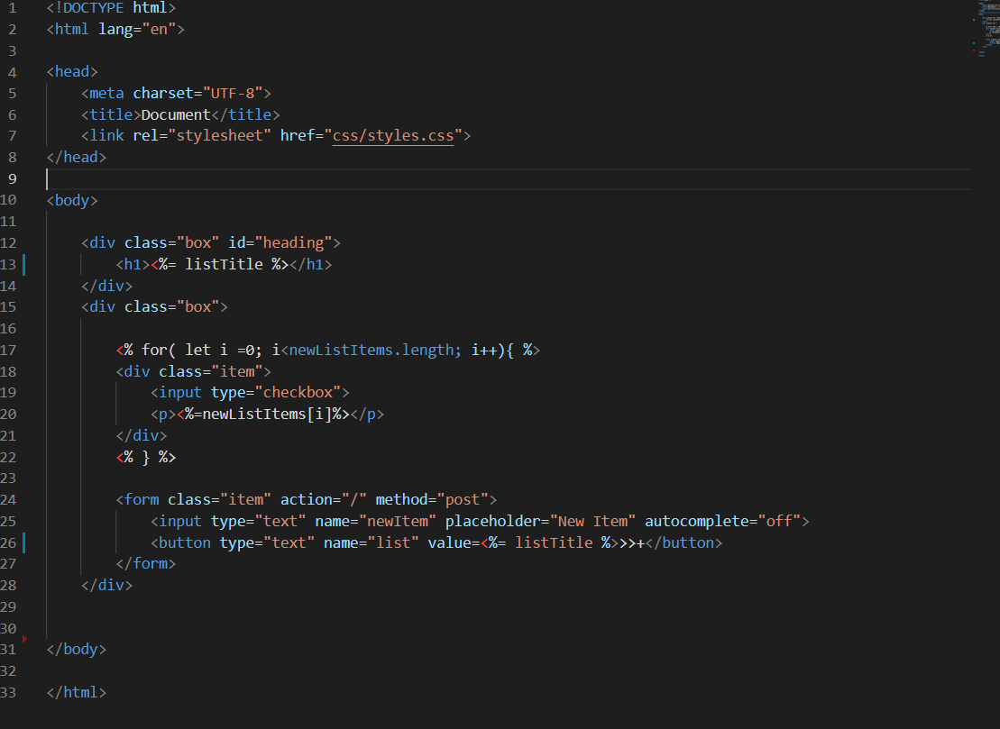

# EJS Layouts come in and help us create projects that are easier to maintain. And for Partials, they are a common templating concept where the idea is to create reusable files that can be reused.

The code might look uselessly longer and has the partials that is everywhere in the ejs file before using layout

The code looks far more cleaner

Not only it helps the project to easier to maintain, they are highly efficient in terms of reusability!

